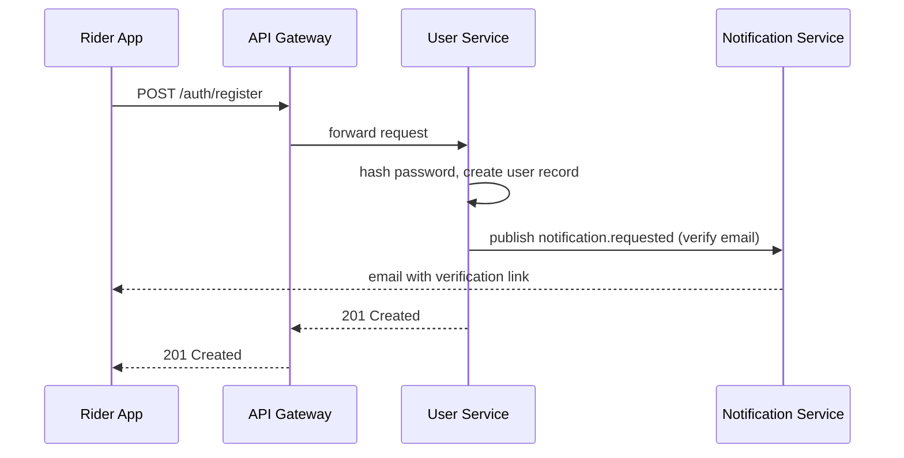
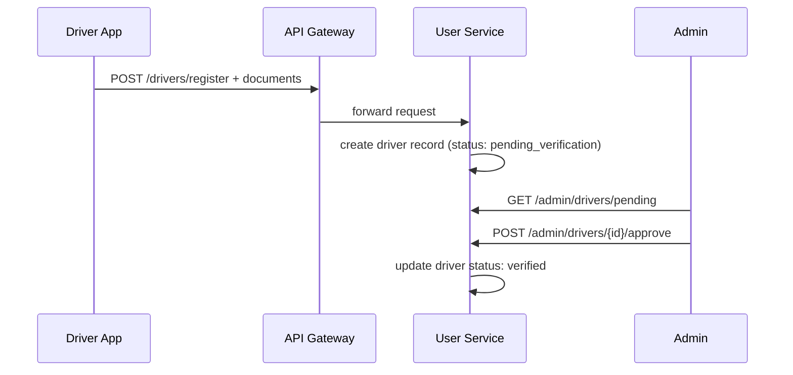
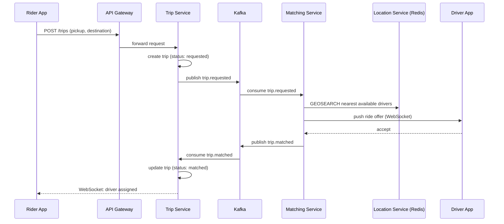
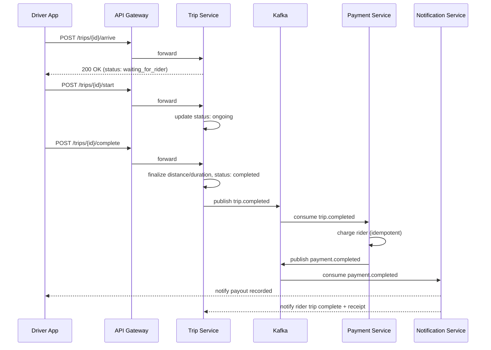
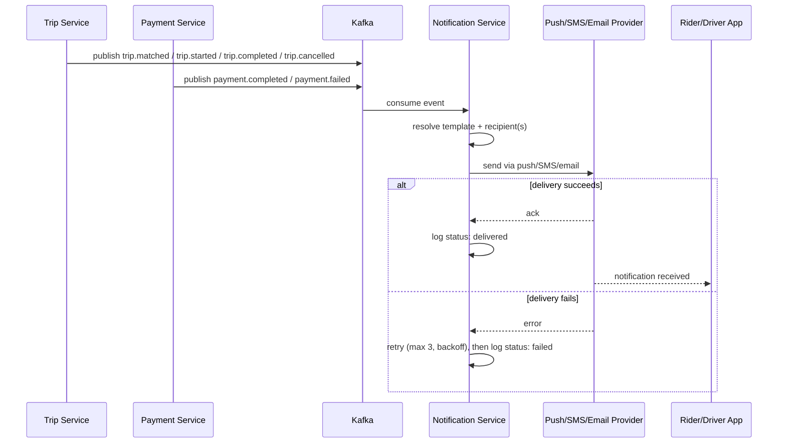

# RideFlow — Software Requirements Specification (SRS)

**Project:** RideFlow — Enterprise Polyglot Ride-Hailing Backend Platform
**Status:** Living document — updated as each roadmap phase is built (see `docs/ROADMAP.md`)

---

## 1. Introduction

### Purpose
RideFlow is a scalable ride-hailing backend platform built on a polyglot microservices
architecture (NestJS, Go, Python). It connects riders with nearby drivers, manages the
full trip lifecycle, calculates fares, processes payments, and delivers real-time
updates through independently deployable backend services communicating over REST,
gRPC, and Kafka.

The platform is a production-style backend project intended to demonstrate distributed
systems architecture: event-driven design, real-time geospatial tracking, service
isolation, and polyglot persistence.

---

## 2. Objectives

The system shall provide:
- Rider registration and authentication
- Driver registration and verification
- Real-time driver location updates
- Ride request and matching
- Fare calculation (including surge pricing)
- Ride lifecycle management
- Payment processing
- Notifications (push/SMS/email)
- Rating and review
- Admin operations and reporting
- Analytics on trips, demand, and driver utilization
- Secure authentication and authorization
- Event-driven, asynchronous inter-service communication

---

## 3. User Roles

### Rider
- Register / Login
- Manage profile
- Request a ride
- Cancel a ride
- Track assigned driver in real time
- View ride history
- Rate and review a driver
- View fare estimate before requesting

### Driver
- Register / Login
- Upload verification documents (license, vehicle registration, insurance)
- Go online / offline
- Accept / reject ride requests
- Start / complete a trip
- View live earnings and trip history
- Update current location continuously while online

### Admin
- Approve/reject driver verification documents
- Suspend/reinstate users or drivers
- View system-wide reports (trips, revenue, active drivers)
- Monitor live trips
- Configure pricing rules (base fare, per-km rate, surge multipliers)
- View system analytics dashboards

---

## 4. Functional Requirements

### 4.1 Authentication (AUTH)
| ID | Requirement |
|---|---|
| AUTH-001 | User shall register using email and password |
| AUTH-002 | System shall send an email verification link/code on registration |
| AUTH-003 | User shall verify their email before full account activation |
| AUTH-004 | User shall log in with email + password |
| AUTH-005 | System shall issue a short-lived JWT access token on login |
| AUTH-006 | System shall issue a long-lived refresh token on login |
| AUTH-007 | System shall allow refreshing an access token via a valid refresh token |
| AUTH-008 | System shall revoke refresh tokens on logout |
| AUTH-009 | System shall support role-based access control (Rider / Driver / Admin) |
| AUTH-010 | System shall rate-limit login attempts to mitigate brute force |
| AUTH-011 | System shall support password reset via emailed one-time link |
| AUTH-012 | System shall hash passwords using a strong adaptive algorithm (bcrypt/argon2) |

### 4.2 Rider (RIDER)
| ID | Requirement |
|---|---|
| RIDER-001 | Rider shall create a profile (name, phone, email, payment method) |
| RIDER-002 | Rider shall update their profile |
| RIDER-003 | Rider shall request a ride with pickup and destination coordinates |
| RIDER-004 | Rider shall receive a fare estimate before confirming a request |
| RIDER-005 | Rider shall cancel a ride before driver arrival |
| RIDER-006 | Rider shall view current trip status and driver location in real time |
| RIDER-007 | Rider shall view full ride history |
| RIDER-008 | Rider shall rate and leave a review for a driver after trip completion |
| RIDER-009 | Rider shall have at most one active ride at a time |
| RIDER-010 | Rider shall be notified of driver assignment, arrival, and trip milestones |

### 4.3 Driver (DRIVER)
| ID | Requirement |
|---|---|
| DRIVER-001 | Driver shall create a profile (name, phone, vehicle info) |
| DRIVER-002 | Driver shall upload license and vehicle documents for verification |
| DRIVER-003 | Driver account shall remain inactive until admin verification is approved |
| DRIVER-004 | Driver shall toggle online/offline availability |
| DRIVER-005 | Driver shall continuously push current location while online |
| DRIVER-006 | Driver shall receive ride requests only while online and available |
| DRIVER-007 | Driver shall accept a ride request within a defined timeout window |
| DRIVER-008 | Driver shall reject a ride request, returning it to the matching pool |
| DRIVER-009 | Driver shall mark trip as "arrived at pickup" |
| DRIVER-010 | Driver shall start a trip only after marking arrival |
| DRIVER-011 | Driver shall complete a trip, triggering fare finalization and payment |
| DRIVER-012 | Driver shall view earnings summary (daily/weekly/monthly) |
| DRIVER-013 | Driver shall not be assigned a new ride while on an active trip |

### 4.4 Trip / Matching (TRIP)
| ID | Requirement |
|---|---|
| TRIP-001 | System shall create a trip record on ride request |
| TRIP-002 | System shall assign the nearest available, verified driver |
| TRIP-003 | System shall enforce a matching timeout, retrying with the next nearest driver on rejection/timeout |
| TRIP-004 | System shall transition trip status through: requested → matched → arriving → ongoing → completed/cancelled |
| TRIP-005 | System shall calculate trip distance and duration from GPS trace |
| TRIP-006 | System shall store full trip history with timestamps for each state transition |
| TRIP-007 | System shall allow cancellation with reason codes (rider/driver/system-initiated) |
| TRIP-008 | System shall prevent a completed trip from being modified |
| TRIP-009 | System shall apply a cancellation fee under defined conditions (e.g. after driver arrival) |

### 4.5 Pricing (PRICING)
| ID | Requirement |
|---|---|
| PRICING-001 | System shall calculate fare as base fare + per-km rate + per-minute rate |
| PRICING-002 | System shall apply a surge multiplier based on real-time supply/demand ratio per zone |
| PRICING-003 | System shall show the rider an upfront estimate before confirming |
| PRICING-004 | System shall finalize actual fare based on real trip distance/duration on completion |
| PRICING-005 | Admin shall be able to configure base fare and per-zone rates |

### 4.6 Payment (PAYMENT)
| ID | Requirement |
|---|---|
| PAYMENT-001 | System shall charge the rider's stored payment method on trip completion |
| PAYMENT-002 | System shall process each trip's payment exactly once, even under duplicate event delivery |
| PAYMENT-003 | System shall record all transactions with immutable audit trail |
| PAYMENT-004 | System shall handle and surface payment failures without blocking trip completion status |
| PAYMENT-005 | System shall calculate and record driver payout per completed trip |

### 4.7 Notification (NOTIFICATION)
| ID | Requirement |
|---|---|
| NOTIF-001 | System shall notify rider on driver assignment |
| NOTIF-002 | System shall notify rider on driver arrival |
| NOTIF-003 | System shall notify both parties on trip completion |
| NOTIF-004 | System shall notify driver of new ride requests |
| NOTIF-005 | System shall support push, SMS, and email channels |
| NOTIF-006 | System shall log all notification attempts and delivery status |

### 4.8 Rating (RATING)
| ID | Requirement |
|---|---|
| RATING-001 | Rider shall submit a 1–5 star rating and optional comment after trip completion |
| RATING-002 | Driver shall submit a 1–5 star rating for the rider |
| RATING-003 | System shall compute and expose a rolling average rating per driver |
| RATING-004 | System shall flag drivers below a minimum rating threshold for admin review |

### 4.9 Admin (ADMIN)
| ID | Requirement |
|---|---|
| ADMIN-001 | Admin shall approve or reject driver document verification |
| ADMIN-002 | Admin shall suspend or reinstate a rider or driver account |
| ADMIN-003 | Admin shall view live trip monitoring dashboard |
| ADMIN-004 | Admin shall configure pricing rules |
| ADMIN-005 | Admin shall access aggregate reports (revenue, active users, trip volume) |

### 4.10 Analytics (ANALYTICS)
| ID | Requirement |
|---|---|
| ANALYTICS-001 | System shall record trip and location events for historical analysis |
| ANALYTICS-002 | System shall expose trips-per-hour and average-wait-time metrics |
| ANALYTICS-003 | System shall estimate ETA using historical + real-time data |
| ANALYTICS-004 | System shall support demand heatmaps by zone and time |

### 4.11 Matching Service (MATCH)
| ID | Requirement |
|---|---|
| MATCH-001 | System shall find the nearest available driver to the rider's pickup point |
| MATCH-002 | Matching shall ignore drivers currently offline |
| MATCH-003 | Matching shall ignore drivers currently on an active trip |
| MATCH-004 | Matching shall ignore drivers whose verification status is not approved |
| MATCH-005 | Matching shall expand the search radius incrementally if no driver is found within the initial radius |
| MATCH-006 | Matching shall cap the maximum search radius and return "no drivers available" beyond it |
| MATCH-007 | Matching shall retry with the next-nearest candidate on rejection or acceptance timeout |
| MATCH-008 | System shall enforce a fixed driver acceptance timeout (e.g. 15s) before moving to the next candidate |
| MATCH-009 | Matching shall compute an estimated pickup ETA for each candidate driver |
| MATCH-010 | System shall guarantee a driver cannot be assigned to two concurrent trip offers |
| MATCH-011 | System shall handle concurrent ride requests from different riders without double-assigning the same driver (via atomic claim/lock) |
| MATCH-012 | Matching shall publish `trip.matched` on successful assignment |
| MATCH-013 | Matching shall publish `driver.rejected` when a driver declines or times out |
| MATCH-014 | Matching shall publish a "no drivers available" event/response after exhausting retries and max radius |

### 4.12 Location Service (LOCATION)
| ID | Requirement |
|---|---|
| LOCATION-001 | Driver app shall push GPS coordinates at a regular interval while online |
| LOCATION-002 | System shall stream location updates continuously for the duration of an active session |
| LOCATION-003 | System shall maintain each driver's last known location, accessible in O(1) |
| LOCATION-004 | System shall store live driver positions in Redis using geospatial indexing (GEOADD) |
| LOCATION-005 | System shall track a driver heartbeat and mark a driver offline if no heartbeat is received within a timeout window |
| LOCATION-006 | System shall expire/evict stale location entries for drivers who have gone offline |
| LOCATION-007 | Rider shall be able to subscribe to a specific assigned driver's live location updates |
| LOCATION-008 | System shall support efficient nearest-driver lookup via geospatial radius queries (GEORADIUS/GEOSEARCH) |
| LOCATION-009 | System shall persist a location trace for completed trips for distance calculation and analytics |
| LOCATION-010 | System shall publish `driver.location.updated` events at a throttled rate to avoid overloading downstream consumers |

### 4.13 WebSocket Requirements (WS)
| ID | Requirement |
|---|---|
| WS-001 | Driver app shall establish a persistent WebSocket connection while online |
| WS-002 | Rider app shall establish a WebSocket connection while tracking an active trip |
| WS-003 | WebSocket connections shall be authenticated using the JWT access token at handshake time |
| WS-004 | System shall exchange periodic ping/pong heartbeat frames to detect dead connections |
| WS-005 | Client shall support automatic reconnection with backoff on disconnect |
| WS-006 | System shall broadcast driver location updates to the subscribed rider's connection |
| WS-007 | System shall broadcast trip status changes (matched, arriving, started, completed, cancelled) to relevant connections |
| WS-008 | System shall push driver assignment events to the driver's connection for accept/reject |
| WS-009 | System shall push driver arrival events to the rider's connection |
| WS-010 | System shall push trip completion events (with final fare) to both parties |
| WS-011 | System shall close and clean up idle connections after a defined inactivity timeout |

---

## 5. Non-Functional Requirements

### Performance
- API latency (gateway → response) shall be < 200ms at p95 for non-matching endpoints
- Matching latency shall be < 3–5s from request to driver assignment under normal load
- WebSocket location update latency shall be < 100ms end to end
- System shall support 10,000 concurrent active users as an initial target

### Availability
- Target 99.9% uptime for the platform overall
- No single service failure (e.g. notifications) shall take down the core request→match→trip flow

### Scalability
- Every microservice shall scale horizontally and independently
- Stateless services (gateway, matching) shall scale via replica count; stateful pieces
  (Postgres, Mongo) scale via read replicas/sharding as a later concern

### Consistency model
- Payment and trip-state transitions: strong consistency (ACID transactions)
- Driver location and analytics: eventual consistency is acceptable

### Security
- All traffic over HTTPS/TLS
- JWT-based authentication, RBAC for authorization
- Passwords hashed with bcrypt/argon2, never stored in plaintext
- Input validation at every service boundary (defense in depth, not just at the gateway)
- Rate limiting at the gateway
- Audit logging for admin actions and payment events

### Reliability
- Kafka consumers shall be idempotent (at-least-once delivery assumed)
- Critical writes (payment) shall use idempotency keys

### Observability
- Structured logs across all services
- Distributed tracing across service boundaries (see Roadmap Phase 10)
- Health/readiness endpoints on every service

---

## 6. State Machines

### 6.1 Driver State

```
Offline
  ↓ (go online)
Online / Available
  ↓ (assigned to a ride)
Assigned
  ↓ (accepts and drives to pickup)
Busy (en route / on trip)
  ↓ (trip completed or driver goes offline)
Offline
```

Valid transitions:
- Offline → Online (driver toggles availability, must be verified)
- Online → Assigned (matched to a trip request)
- Assigned → Busy (driver accepts; Assigned → Online if driver rejects/times out)
- Busy → Online (trip completed, driver remains online for next match)
- Online/Busy → Offline (driver manually goes offline; Busy→Offline is deferred until trip ends)

Invalid transitions:
- Offline → Assigned (driver must be online first)
- Busy → Assigned (driver cannot be double-booked — enforced by MATCH-010)
- Unverified driver → Online (blocked by DRIVER-003)

### 6.2 Trip State

```
Requested
  ↓
Searching (matching in progress)
  ↓
Driver Assigned
  ↓
Driver Arriving
  ↓
Waiting for Rider (driver at pickup)
  ↓
Trip Started
  ↓
Completed
```

Alternative paths:
```
Requested → Cancelled            (rider cancels before match)
Searching → Cancelled            (no drivers available / rider cancels)
Driver Assigned → Cancelled      (rider or driver cancels before pickup)
Driver Arriving → Cancelled      (rider cancels, may incur fee per TRIP-009/BR-010)
Waiting for Rider → Cancelled    (rider no-show timeout)
```

Invalid transitions:
- Trip Started → Cancelled (a started trip can only reach Completed; abort scenarios use a
  distinct "Aborted" status, not "Cancelled")
- Completed → any other state (immutability per TRIP-008 / BR-004)
- Requested → Trip Started (must pass through Searching/Assigned/Arriving/Waiting)

### 6.3 Rider State

```
Guest
  ↓ (register + verify email)
Registered
  ↓ (login)
Active (idle)
  ↓ (request ride)
Active (trip in progress)
  ↓ (trip completes/cancels)
Active (idle)
```

Suspended state (admin-initiated) is reachable from any Active state and blocks new ride
requests until reinstated (ADMIN-002).

---

## 7. Sequence Diagrams

### 7.1 Rider Registration


### 7.2 Driver Registration & Verification


### 7.3 Ride Request & Matching


### 7.4 Trip Start & Completion


### 7.5 Notification Flow


---

## 8. Microservices — Detailed Specifications

### 8.1 API Gateway
- **Responsibilities:** request routing, JWT validation, rate limiting, request aggregation, CORS
- **Owned database:** none (stateless)
- **REST APIs:** proxies all public endpoints under `/api/v1/*`
- **Dependencies:** all downstream services
- **Failure scenarios:** downstream service unavailable → circuit breaker returns 503 with retry-after
- **Retry strategy:** limited retries (2x) with exponential backoff on idempotent GET requests only

### 8.2 User Service
- **Responsibilities:** rider/driver identity, profile, authentication, document verification status
- **Owned database:** PostgreSQL (`users`, `drivers`, `documents`)
- **REST APIs:** `/auth/*`, `/users/*`, `/drivers/*`
- **Published Kafka events:** `notification.requested` (on registration, password reset)
- **Consumed Kafka events:** none
- **Business rules:** DRIVER-003 (inactive until verified), AUTH-009 (RBAC)
- **Validation rules:** email format, password strength, required document types
- **Failure scenarios:** duplicate email on register → 409 Conflict
- **Retry strategy:** none required (synchronous CRUD)

### 8.3 Trip Service
- **Responsibilities:** trip state machine, trip history, cancellation logic
- **Owned database:** PostgreSQL (`trips`, `trip_events`)
- **REST APIs:** `/trips`, `/trips/{id}`, `/trips/{id}/cancel`, `/trips/{id}/arrive`, `/trips/{id}/start`, `/trips/{id}/complete`
- **Published Kafka events:** `trip.requested`, `trip.started`, `trip.completed`, `trip.cancelled`
- **Consumed Kafka events:** `trip.matched`, `driver.rejected`
- **Dependencies:** Pricing Service (fare estimate), Matching Service (via Kafka)
- **Business rules:** BR-002, BR-003, BR-004, BR-008, BR-009
- **Failure scenarios:** no drivers available → trip status set to `cancelled` with reason `no_drivers`
- **Retry strategy:** consumer offset retry with dead-letter topic after N failed processing attempts

### 8.4 Payment Service
- **Responsibilities:** charge processing, driver payouts, transaction ledger
- **Owned database:** PostgreSQL (`transactions`, `payouts`)
- **REST APIs:** `/payments/{tripId}`, `/drivers/{id}/earnings`
- **Published Kafka events:** `payment.completed`, `payment.failed`
- **Consumed Kafka events:** `trip.completed`
- **Business rules:** BR-009 (idempotency), PAYMENT-002
- **Failure scenarios:** payment gateway timeout → mark `payment.failed`, trip status unaffected (PAYMENT-004)
- **Retry strategy:** idempotency key = trip ID; safe to reprocess duplicate `trip.completed` events

### 8.5 Driver Location Service (Go)
- **Responsibilities:** ingest GPS pings, maintain live geo index, heartbeat/offline detection
- **Owned database:** Redis (geo index + heartbeat keys)
- **REST/WebSocket APIs:** `WS /drivers/{id}/location`
- **Published Kafka events:** `driver.location.updated` (throttled), `driver.availability.changed`
- **Consumed Kafka events:** none
- **Business rules:** LOCATION-005, LOCATION-006
- **Failure scenarios:** Redis unavailable → service degrades to reject new location writes, alerts fired
- **Retry strategy:** client-side reconnect with backoff (WS-005)

### 8.6 Matching Service (Go)
- **Responsibilities:** nearest-driver search, offer dispatch, retry/expansion logic
- **Owned database:** none (reads Redis via Location Service's index)
- **gRPC APIs:** internal `FindNearestDrivers(pickup, radius)`
- **Published Kafka events:** `trip.matched`, `driver.rejected`
- **Consumed Kafka events:** `trip.requested`
- **Dependencies:** Driver Location Service (Redis geo queries)
- **Business rules:** MATCH-001 through MATCH-014
- **Failure scenarios:** no candidates within max radius → publish "no drivers available"
- **Retry strategy:** internal retry loop across candidate list, bounded by MATCH-008 timeout × max attempts

### 8.7 Notification Service (Python)
- **Responsibilities:** multi-channel notification fan-out, delivery logging
- **Owned database:** MongoDB (`notifications`)
- **REST APIs:** none public (internal only)
- **Consumed Kafka events:** `trip.matched`, `trip.started`, `trip.completed`, `trip.cancelled`, `payment.completed`, `payment.failed`, `notification.requested`
- **Business rules:** NOTIF-001 through NOTIF-006
- **Failure scenarios:** provider (SMS/push) unavailable → log failure, do not block other consumers
- **Retry strategy:** per-channel retry with backoff, max 3 attempts, then dead-letter

### 8.8 Pricing Service (Python)
- **Responsibilities:** fare estimation, surge multiplier calculation
- **Owned database:** none (or lightweight cache of zone configs)
- **REST APIs:** `GET /pricing/estimate`
- **Consumed Kafka events:** `trip.requested`, `driver.availability.changed` (for surge calc inputs)
- **Business rules:** PRICING-001 through PRICING-005, BR-012
- **Failure scenarios:** pricing config unavailable → fall back to last known base rates
- **Retry strategy:** stateless, safe to retry on timeout

### 8.9 Analytics Service (Python)
- **Responsibilities:** event ingestion for historical analysis, ETA estimation, reporting
- **Owned database:** MongoDB (`trip_events`, `location_history`)
- **REST APIs:** `/analytics/trips-per-hour`, `/analytics/eta`, `/analytics/heatmap`
- **Consumed Kafka events:** `trip.started`, `trip.completed`, `trip.cancelled`, `driver.location.updated`
- **Business rules:** ANALYTICS-001 through ANALYTICS-004
- **Failure scenarios:** consumer lag under high load → acceptable (eventual consistency, LOCATION model)
- **Retry strategy:** consumer group offset commit only after successful write

---

## 9. Database Design

*(Full ERD and SQL/schema definitions are produced per-service during its build phase — see
Roadmap. This section defines ownership boundaries and query-shape requirements up front.)*

### 9.1 User Service (PostgreSQL)
- **Tables:** `users` (PK: id), `drivers` (PK: id, FK by ID: user_id), `documents` (PK: id, FK by ID: driver_id)
- **Indexes:** unique index on `users.email`, index on `drivers.verification_status`
- **Constraints:** email uniqueness, non-null password hash
- **Partitioning:** not required at initial scale

### 9.2 Trip Service (PostgreSQL)
- **Tables:** `trips` (PK: id, FK by ID: rider_id, driver_id), `trip_events` (PK: id, FK by ID: trip_id)
- **Indexes:** index on `trips.rider_id`, `trips.driver_id`, `trips.status`
- **Constraints:** trip cannot reference itself; one active trip per rider enforced at application layer (BR-002)
- **Partitioning:** consider time-based partitioning of `trip_events` at scale

### 9.3 Payment Service (PostgreSQL)
- **Tables:** `transactions` (PK: id, FK by ID: trip_id, unique), `payouts` (PK: id, FK by ID: driver_id)
- **Indexes:** unique index on `transactions.trip_id` (enforces idempotency at the DB layer)
- **Constraints:** amount > 0, status enum constrained

### 9.4 Notification Service (MongoDB)
- **Collections:** `notifications` (fields: userId, channel, type, status, payload, createdAt)
- **Indexes:** compound index on `{userId, createdAt}`, index on `status`
- **Partitioning:** natural sharding candidate by `userId` at scale

### 9.5 Analytics Service (MongoDB)
- **Collections:** `trip_events`, `location_history`
- **Indexes:** geospatial index (`2dsphere`) on location fields, compound index on `{tripId, timestamp}`
- **Partitioning:** time-based collection sharding for `location_history` at scale

### 9.6 Location Service (Redis)
- **Structures:** geo set `drivers:locations` (GEOADD), hash `driver:{id}:heartbeat` with TTL
- **No relational schema** — ephemeral, in-memory by design

---

## 10. Kafka Event Contracts

Each event below extends the summary table already established; full payload schemas
are finalized alongside each producing service's implementation.

### `trip.requested`
- **Producer:** Trip Service
- **Consumers:** Matching Service, Pricing Service
- **Payload:** `{ tripId, riderId, pickup: {lat,lng}, destination: {lat,lng}, requestedAt }`
- **Retry behavior:** consumer group retry with dead-letter topic after 5 failed attempts
- **Idempotency:** `tripId` is the natural dedup key

### `trip.matched`
- **Producer:** Matching Service
- **Consumers:** Trip Service, Notification Service
- **Payload:** `{ tripId, driverId, etaSeconds, matchedAt }`
- **Idempotency:** Trip Service ignores if trip is already in `matched` or later state

### `driver.rejected`
- **Producer:** Matching Service
- **Consumers:** Matching Service (self, to trigger retry), Analytics Service
- **Payload:** `{ tripId, driverId, reason: rejected|timeout }`

### `trip.started` / `trip.completed` / `trip.cancelled`
- **Producer:** Trip Service
- **Consumers:** Notification Service, Analytics Service; `trip.completed` also → Payment Service
- **Payload:** `{ tripId, riderId, driverId, timestamp, ...stateSpecificFields }`
- **Idempotency:** Payment Service dedups via unique constraint on `transactions.trip_id`

### `driver.location.updated`
- **Producer:** Driver Location Service
- **Consumers:** Analytics Service
- **Payload:** `{ driverId, lat, lng, timestamp }`
- **Retry behavior:** best-effort, no dead-letter (high-volume, eventually-consistent data)

### `payment.completed` / `payment.failed`
- **Producer:** Payment Service
- **Consumers:** Notification Service, Analytics Service
- **Payload:** `{ tripId, transactionId, amount, status, timestamp }`

### `notification.requested`
- **Producer:** any service
- **Consumers:** Notification Service
- **Payload:** `{ userId, channel, type, templateData }`

---

## 11. API Contracts

*(Full contract — request/response schema, status codes, validation, auth requirements,
example payloads — written per endpoint as each service is implemented, so contracts stay
in sync with real code rather than drifting from an upfront spec.)*

---

## 12. API Versioning Strategy

- **URI versioning:** all public endpoints are prefixed `/api/v1/...`; the gateway is the
  only place version routing is resolved
- **Future compatibility:** additive changes (new optional fields, new endpoints) do not
  bump the version; breaking changes require a new version prefix (`/api/v2/...`)
- **Deprecation policy:** a deprecated version is supported for a minimum announced window
  (e.g. 6 months) with a `Deprecation` response header before removal
- **Breaking changes strategy:** breaking changes are never introduced in place; a new
  version is stood up alongside the old one, clients migrate, then the old version is retired

---

## 13. Service Communication Strategy

| Protocol | Used for | Why |
|---|---|---|
| **REST** | Client ↔ API Gateway, and Gateway ↔ services for simple request/response | Simple, cacheable, easy to document/version for external-facing contracts |
| **gRPC** | Service-to-service synchronous calls (e.g. Matching → Location) | Low latency, strongly typed via Protobuf, efficient binary serialization for internal high-frequency calls |
| **Kafka (events)** | Cross-service state propagation (trip lifecycle, payments, notifications) | Decouples producers/consumers, survives consumer downtime, natural fit for at-least-once event-driven workflows |
| **WebSocket** | Live location streaming, real-time trip status push to clients | Only viable option for low-latency server-to-client push without polling |

General rule: use REST for anything a browser/mobile client calls directly; use gRPC for
internal synchronous calls where latency matters; use Kafka for anything that represents
"something happened" that multiple services care about; use WebSocket only for the
client-facing real-time channel.

---

## 14. Security Architecture

- **JWT Authentication:** short-lived access tokens (e.g. 15 min) + long-lived refresh tokens (e.g. 7 days)
- **Refresh Tokens:** stored hashed server-side, revocable individually, rotated on use
- **RBAC:** roles (`rider`, `driver`, `admin`) enforced via guards at the gateway and re-checked at each service
- **Password Hashing:** bcrypt/argon2 with per-user salt, never logged or returned in responses
- **Rate Limiting:** per-IP and per-user limits at the gateway, stricter limits on auth endpoints
- **HTTPS:** enforced everywhere, HSTS enabled
- **Input Validation:** DTO-level validation (class-validator in NestJS, pydantic in Python, struct validation in Go) at every service boundary, not only the gateway
- **CORS:** explicit allow-list of client origins, no wildcard in production
- **CSRF considerations:** primarily mitigated by using bearer tokens (not cookies) for API auth; if cookies are ever used for session/refresh storage, CSRF tokens are required
- **API Gateway security:** gateway terminates TLS, validates JWT before proxying, strips sensitive headers from downstream responses
- **Secret management:** secrets injected via environment variables backed by a secret store (not committed to the repo); see Deployment Architecture
- **Audit Logging:** all admin actions and payment state changes are logged immutably with actor, timestamp, and before/after state

---

## 15. Deployment Architecture

- **Local development:** Docker Compose brings up all services + infra (Kafka, Redis, PostgreSQL, MongoDB, NGINX) with a single command
- **API Gateway:** fronts all services; also where NGINX (or the gateway itself) can terminate TLS and load-balance in production
- **NGINX:** reverse proxy / load balancer in front of the API Gateway replicas in production
- **Redis:** single instance for local dev; production uses a managed/clustered Redis for geo data
- **PostgreSQL:** one instance per owning service in production (separate DBs, not just separate schemas) to preserve service isolation
- **MongoDB:** shared cluster with per-service databases (Notification, Analytics)
- **Kafka:** single-broker for local dev; multi-broker cluster with replication in production
- **Environment variables:** each service reads config exclusively from environment variables, documented in a `.env.example` per service
- **Secrets management:** local dev uses `.env` files (gitignored); production uses a secret manager (e.g. Vault, cloud provider secret store) injected at deploy time
- **Service discovery:** Docker Compose uses service-name DNS for local dev; production (future Kubernetes) uses native k8s service discovery
- **Kubernetes (future):** each service becomes a Deployment + Service; stateful infra (Kafka, PostgreSQL, MongoDB, Redis) run as managed services or StatefulSets; manifests live in `infra/k8s/` (see Roadmap Phase 10)

---

## 16. Observability

- **Structured Logging:** every service emits structured JSON logs with a correlation/trace ID propagated across service boundaries
- **Distributed Tracing:** OpenTelemetry instrumentation across NestJS, Go, and Python services, exported to a common backend, so a single rider request can be traced end-to-end through Gateway → Trip → Matching → Location
- **Metrics:** each service exposes a `/metrics` endpoint (Prometheus format) — request rates, latencies, error rates, Kafka consumer lag, Redis query latency
- **Health Checks:** `/health` endpoint per service reporting overall service status
- **Readiness Checks:** `/ready` endpoint indicating whether the service can accept traffic (e.g. DB connection established)
- **Liveness Checks:** `/live` endpoint indicating the process itself hasn't deadlocked/hung (used by orchestrator to decide restarts)
- **Monitoring with Prometheus:** scrapes `/metrics` from all services on an interval
- **Dashboards with Grafana:** visualizes latency, error rate, throughput, and Kafka lag per service; alerting rules on SLO breaches (e.g. matching latency > 5s p95)

---

## 17. Scalability Strategy

| Component | Scaling approach |
|---|---|
| API Gateway | Stateless — scale horizontally behind a load balancer |
| Trip / User / Payment Service (NestJS) | Stateless app layer — scale horizontally; DB is the bottleneck, addressed via read replicas |
| Matching / Location Service (Go) | Stateless app layer — scale horizontally; designed for high concurrency per instance via goroutines |
| Notification / Pricing / Analytics (Python) | Stateless app layer — scale horizontally; async workers scale by adding consumer instances |
| Redis | Vertical scaling first; cluster mode (sharded) for geo data at large scale |
| PostgreSQL | Read replicas for read-heavy paths; partitioning for large tables (e.g. `trip_events`); sharding by service is the isolation boundary, not a single shared DB |
| MongoDB | Horizontal sharding by a high-cardinality key (e.g. `userId`, `driverId`) at scale |
| Kafka | Increase partition count per topic to parallelize consumers; scale broker count for throughput and replication |

General principle: every service is stateless at the application layer, so scaling is
"add more instances behind the gateway/consumer group" — all actual state lives in the
owned datastore, which is what gets a dedicated scaling strategy per component above.

---

## 18. Error Code Catalog

### Authentication
| Code | HTTP Status | Description | When it occurs |
|---|---|---|---|
| AUTH_ERR_001 | 401 | Invalid credentials | Login with wrong email/password |
| AUTH_ERR_002 | 403 | Email not verified | Login attempt before email verification |
| AUTH_ERR_003 | 401 | Expired access token | Access token TTL exceeded |
| AUTH_ERR_004 | 401 | Invalid/revoked refresh token | Refresh attempt with a revoked or malformed token |
| AUTH_ERR_005 | 409 | Email already registered | Duplicate registration attempt |
| AUTH_ERR_006 | 429 | Too many login attempts | Rate limit exceeded on auth endpoint |

### Trip
| Code | HTTP Status | Description | When it occurs |
|---|---|---|---|
| TRIP_ERR_001 | 409 | Rider already has an active trip | Violates BR-002 |
| TRIP_ERR_002 | 404 | Trip not found | Invalid trip ID |
| TRIP_ERR_003 | 409 | Trip cannot be modified in current state | Attempt to modify a completed/cancelled trip |
| TRIP_ERR_004 | 422 | Invalid state transition | e.g. attempting to start a trip before arrival |
| TRIP_ERR_005 | 409 | No drivers available | Matching exhausted retries/radius (MATCH-006) |

### Driver
| Code | HTTP Status | Description | When it occurs |
|---|---|---|---|
| DRIVER_ERR_001 | 403 | Driver not verified | Attempt to go online before verification approval |
| DRIVER_ERR_002 | 409 | Driver already on an active trip | Violates DRIVER-013 |
| DRIVER_ERR_003 | 422 | Missing required documents | Verification submission incomplete |
| DRIVER_ERR_004 | 403 | Driver account suspended | Suspended driver attempts an action |

### Matching
| Code | HTTP Status | Description | When it occurs |
|---|---|---|---|
| MATCH_ERR_001 | 409 | Driver already assigned elsewhere | Race condition caught by atomic claim (MATCH-010/011) |
| MATCH_ERR_002 | 408 | Driver acceptance timeout | Driver did not respond within MATCH-008 window |
| MATCH_ERR_003 | 404 | No candidate drivers found | Empty result from geo query before radius expansion completes |

### Payment
| Code | HTTP Status | Description | When it occurs |
|---|---|---|---|
| PAYMENT_ERR_001 | 402 | Charge failed | Payment gateway declined the transaction |
| PAYMENT_ERR_002 | 409 | Duplicate payment attempt | Reprocessing an already-settled `tripId` (blocked by unique constraint) |
| PAYMENT_ERR_003 | 422 | Invalid payment method | Rider's stored payment method is invalid/expired |

### Notification
| Code | HTTP Status | Description | When it occurs |
|---|---|---|---|
| NOTIF_ERR_001 | 502 | Provider delivery failure | Push/SMS/email provider unreachable or errored |
| NOTIF_ERR_002 | 422 | Invalid template data | Missing required fields for the notification template |

---

## 19. Business Rules

| ID | Rule |
|---|---|
| BR-001 | A driver cannot accept two active rides simultaneously |
| BR-002 | A rider can only have one active ride at a time |
| BR-003 | A trip cannot start before the driver marks arrival at pickup |
| BR-004 | A completed trip cannot be modified |
| BR-005 | Only verified drivers may receive ride requests |
| BR-006 | A driver must be online and available to be considered for matching |
| BR-007 | Matching shall retry with the next-nearest driver if the current one rejects/times out |
| BR-008 | A rider cannot request a new ride while one is already active |
| BR-009 | Payment processing must be idempotent per trip |
| BR-010 | A trip cancelled after driver arrival may incur a cancellation fee |
| BR-011 | A driver below the minimum rating threshold shall be flagged for admin review |
| BR-012 | Surge pricing multiplier shall be capped at a configurable maximum |

---

## 20. Future Features (Out of scope for v1)

- Ride pooling / shared rides
- In-app wallet
- Promo codes / referral credits
- Scheduled rides
- SOS / emergency button
- Driver incentive programs
- Rider subscription tiers
- AI-based ETA prediction (beyond heuristic)
- AI-based dynamic surge pricing (beyond ratio heuristic)
- Voice-based booking
